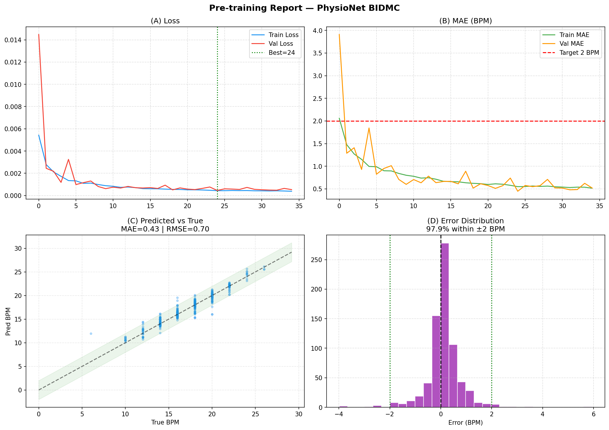
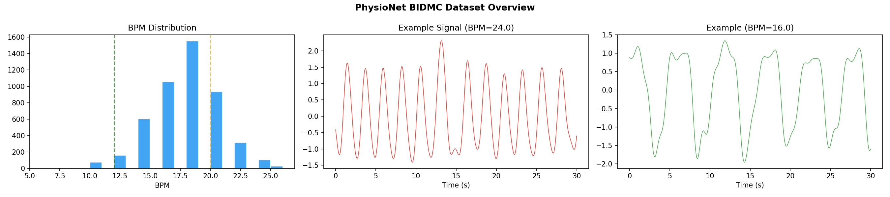
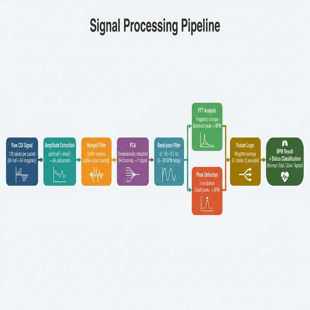

# ESP32-WiFi-Sensing: Contactless Respiration Rate Detection

> Nhận diện nhịp thở không tiếp xúc bằng WiFi CSI, xử lý trên Edge Device (PC / Jetson Nano), hỗ trợ Deep Learning 1D-CNN + LSTM.

---

##  Kiến trúc Hệ thống

<p align="center">
  
  <br>
  <i>Hình 1: Sơ đồ kiến trúc tổng thể của hệ thống đo nhịp thở không tiếp xúc (V2).</i>
</p>

---

##  Kết quả Pre-training  

Chúng tôi đã thực hiện **Pre-training** mô hình Deep Learning (1D-CNN + LSTM) trên dataset lớn **PhysioNet BIDMC** (4,823 mẫu nhịp thở thực tế) để tạo ra bộ trọng số khởi tạo tối ưu cho tín hiệu WiFi CSI.

### Hiệu suất đạt được:
- **MAE (Sai số trung bình)**: **0.43 BPM** (Mục tiêu dự án: ≤ 2 BPM)
- **RMSE**: **0.70 BPM**
- **Độ tin cậy (±2 BPM)**: **97.9%**

<p align="center">
  
  <br>
  <i>Hình 2: Báo cáo đánh giá mô hình sau khi Pre-train trên PhysioNet BIDMC.</i>
</p>

<p align="center">
  
  <br>
  <i>Hình 3: Phân phối BPM và đặc trưng sóng nhịp thở từ bộ dữ liệu tham chiếu.</i>
</p>

---

##  Signal Processing Pipeline

<p align="center">
  
  <br>
  <i>Hình 4: Toàn bộ quá trình xử lý tín hiệu từ RAW CSI → BPM cuối cùng.</i>
</p>

---
##  Cấu trúc dự án

```
ESP32-WiFi-Sensing-2/
├── README.md               ← File này
├── DEPLOYMENT_GUIDE.md     ← Hướng dẫn triển khai từ A → Z
├── requirements.txt
├── .gitmodules             ← Quản lý firmware submodule
├── firmware/
│   └── esp32-csi-tool/      ← [Submodule] Source code firmware gốc
├── models/
│   ├── pretrained_physionet.h5  ← Model đã pre-train (MAE 0.43)
│   ├── respiration_model.onnx   ← Model cuối dùng cho inference
│   └── pretrain_metadata.json
├── notebooks/
│   ├── pretrain_physionet.ipynb ← Script pre-train với PhysioNet
│   └── train_model.ipynb        ← Fine-tune với CSI data thật
└── edge/
    ├── main.py             ← Entry point: Real-time detection
    ├── visualize.py        ← Công cụ vẽ biểu đồ tự động
    ├── evaluate_model.py   ← Benchmarking MAE/RMSE/Latency
    └── src/
        ├── processor.py, estimator.py, mqtt_client.py
        └── model_inferencer.py  ← ONNX Inference cho Edge
```

---

## Quick Start

```bash
# 1. Cài đặt môi trường ảo (venv) và dependencies
python -m venv .venv
.\.venv\Scripts\activate  # Windows
pip install -r requirements.txt

# 2. Thu thập dữ liệu CSI để fine-tune (Stage 1)
python edge/collect_data.py

# 3. Chạy hệ thống Real-time
python edge/main.py
```

> **Hướng dẫn chi tiết:** Xem [DEPLOYMENT_GUIDE.md](./DEPLOYMENT_GUIDE.md)
