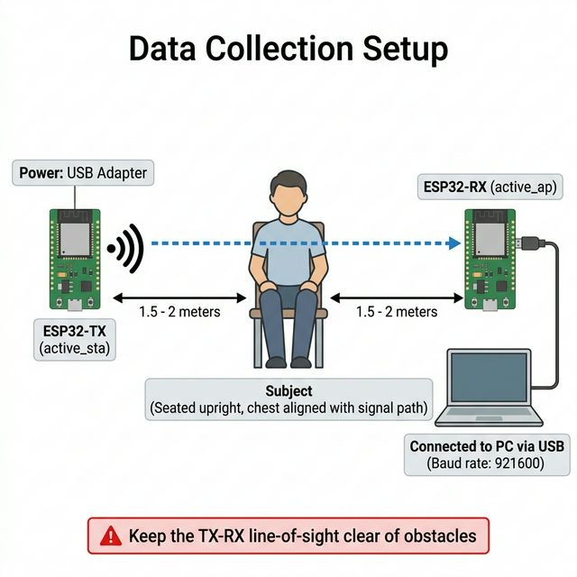

# Hướng dẫn Thu thập Dữ liệu CSI cho Nhận diện Nhịp Thở

---

## Chuẩn bị trước khi bắt đầu

### Thiết bị cần có
- [ ] 2x ESP32 đã nạp firmware (xem `DEPLOYMENT_GUIDE.md` Giai đoạn 1)
- [ ] 1x PC hoặc Jetson Nano có cài Python 3.9+
- [ ] 1x Dây USB để kết nối ESP32-RX
- [ ] 1x Đồng hồ bấm giờ (điện thoại là được)
- [ ] Băng dán / sticker ghi "TX" và "RX" dán lên 2 ESP32

### Thiết lập vật lý (Quan trọng!)




- TX và RX ngang tầm **lồng ngực** của người đo (không phải đầu, không phải bụng).
- Người đo ngồi **chính giữa**, không lệch sang hai bên quá 30cm.
- Giữa TX, người đo và RX phải **thông thoáng** (không có bàn, ghế hoặc vật cản lớn).

---

## Quy trình thu 1 mẫu dữ liệu

### Bước 1 — Bật ESP32
1. Cắm điện **ESP32-TX** trước (nguồn pin hoặc USB adapter).
2. Cắm **ESP32-RX** vào PC/Jetson Nano qua USB.
3. Chờ khoảng **5 giây** để hai thiết bị kết nối WiFi với nhau.

### Bước 2 — Mở terminal trên PC

```bash
cd ESP32-WiFi-Sensing-2
```

### Bước 3 — Chọn kịch bản và cấu hình

Mở file `edge/collect_data.py`, chỉnh:

```python
SERIAL_PORT      = "COM3"       # Windows: COM3, COM4... | Linux: /dev/ttyUSB0
SUBJECT_NAME     = "An"         # Tên người được đo
BPM_GROUND_TRUTH = "placeholder" # Điền sau khi đo xong (xem Bước 4)
```

> Xem file kịch bản tương ứng trong thư mục này để biết `BPM_GROUND_TRUTH` cần điền.

### Bước 4 — Đo nhịp thở trước

Trước khi chạy script, đếm nhịp thở của người đo:
1. Bật đồng hồ bấm giờ **60 giây**.
2. Đếm số lần ngực phồng lên (= 1 nhịp thở).
3. Điền số đếm được vào `BPM_GROUND_TRUTH` trong file.
4. Lưu file.

### Bước 5 — Chạy thu thập

```bash
python edge/collect_data.py
```

Terminal sẽ hiển thị:
```
[*] Đang mở cổng COM3...
[*] Đang ghi file: datasets/An_BPM16_20240320_090000.csv
[+] Nhận packet #1...
[+] Nhận packet #2...
```

### Bước 6 — Thực hiện kịch bản

Trong **120 giây** (2 phút) khi script đang chạy:
- Người đo thực hiện đúng kịch bản đã chọn.
- Người điều khiển theo dõi terminal, đảm bảo số packet tăng đều (không bị dừng).

> **Dấu hiệu lỗi**: Nếu terminal dừng in packet > 5 giây, khả năng ESP32-RX bị ngắt kết nối. Dừng script và kiểm tra lại USB.

### Bước 7 — Dừng và lưu

Nhấn **Ctrl+C** sau khoảng 120 giây.
File CSV sẽ được lưu tự động vào thư mục `datasets/`.

### Bước 8 — Kiểm tra chất lượng

```bash
python edge/verify_data.py datasets/An_BPM16_20240320_090000.csv
```

**Kết quả đạt yêu cầu:**
```
[+] Tổng số packets: 12000+
[+] CSI hợp lệ: 98%+
[+] Tần số ước tính: 95–105 Hz
```

**Nếu không đạt**: Xóa file và thu lại từ Bước 1.

---

## Checklist mỗi buổi thu

Dán checklist này lên bàn trong buổi thu dữ liệu:

```
□ TX và RX đã bật và đã kết nối WiFi với nhau
□ Serial port đúng (COM3 hay /dev/ttyUSB0?)
□ Tên người đo đã điền vào SUBJECT_NAME
□ BPM_GROUND_TRUTH đã đo và điền đúng
□ Phòng yên tĩnh, không có người đi lại lạ
□ Người đo ngồi đúng vị trí giữa TX–RX
□ Script chạy thấy packet tăng đều
□ Đã thu đủ 120 giây
□ verify_data.py đã kiểm tra → PASS
```

---

## Mục tiêu dataset tổng thể

> Thu ít nhất **14 file CSV** phân bổ như sau:

| Kịch bản | File cần thu |
|:---|:---|
| Thở bình thường (`01`) | 5 file |
| Thở chậm (`02`) | 2 file |
| Thở nhanh (`03`) | 2 file |
| Ngưng thở (`04`) | 2 file |
| Có nhiễu (`05`) | 3 file (1 mỗi loại nhiễu) |

---

## Ghi chú nhanh sau mỗi lần thu

Sau mỗi file, ghi vào sổ tay hoặc file `datasets/log.txt`:

```
[2024-03-20 09:00] An_BPM16 - Normal - OK - 12240 packets
[2024-03-20 09:05] An_BPM7  - Slow   - OK - 12180 packets
[2024-03-20 09:10] An_BPM0  - Apnea  - FAIL - 800 packets (USB bị rút)
```
